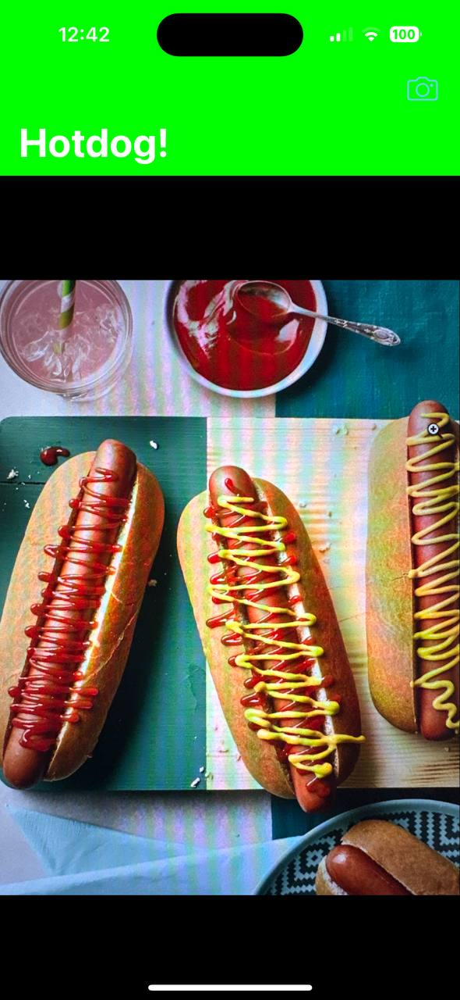
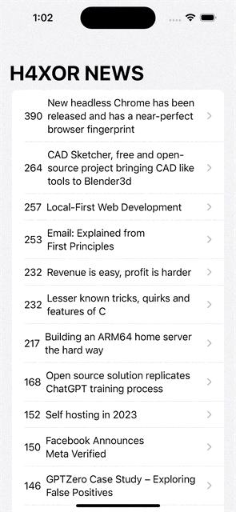

# Weather Brick Application

An application that uses the location and weather API to represent weather conditions with a unique, fun, and intuitive interface: the weather brick on a rope.
-----------------------------------------------------

 
 
 

## Table of Contents

- [Functionality](#functionality)
- [Tech Stack](#tech-stack)
- [Additions & Explanations](#additions--explanations)

## Functionality

The app will:

- Determine the current location of the user and display the weather.
- Display weather conditions as a brick on a rope. Each weather condition corresponds to a unique state of the brick:
  - If it's raining outside, the brick is wet.
  - If it's sunny outside, the brick is dry.
  - If there is fog outside, the brick is hard to see.
  - If it is very hot outside, the brick is covered with cracks.
  - If it snows outside, the brick is covered with snow.
  - In strong winds, the brick is deflected on the rope.
  - If there is no internet connection and the data is not updated, the brick disappears from the rope.
- Implement pull-to-refresh behavior. When pulling the rope down, there is a visual response.
- Support iOS 11 and higher.
- Support portrait mode only.
- Be designed for iPhone devices only.

## Tech Stack

The app is developed using:

- [Swift](https://developer.apple.com/swift/)
- [UIKit](https://developer.apple.com/documentation/uikit)
- [Auto Layout](https://developer.apple.com/library/archive/documentation/UserExperience/Conceptual/AutolayoutPG/index.html)
- [Storyboard](https://developer.apple.com/library/archive/documentation/General/Conceptual/Devpedia-CocoaApp/Storyboard.html)
- [URLSession](https://developer.apple.com/documentation/foundation/urlsession)
- [Codable](https://developer.apple.com/documentation/swift/codable)
- [Gesture Recognizers](https://developer.apple.com/documentation/uikit/touches_presses_and_gestures/handling_uikit_gestures)
- [MVC](https://developer.apple.com/library/archive/documentation/General/Conceptual/DevPedia-CocoaCore/MVC.html) - Model View Controller design pattern.
- Third-party APIs

Design instruments:

- [Figma](https://www.figma.com)

## Additions & Explanations

API: 

We utilize free public APIs for weather data, for example: [OpenWeatherMap API](https://openweathermap.org/api)

Design: 

You can view the design [here](https://www.figma.com/file/nHC46KcYmpBopRfjxRcu6Q/Weather-forecast)

